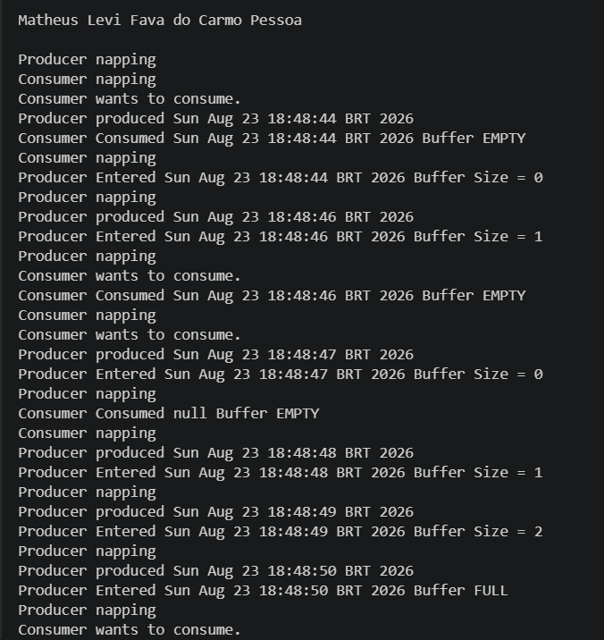

# Atividade 02 - Produtor-Consumidor

## Descrição
Evidenciar a execução do programa Produtor-Consumidor em Java anexo aos Recursos. Fazer print da execução do programa com o nome do aluno.

## Evidência de Execução
Abaixo está o print comprovando a execução do código:

